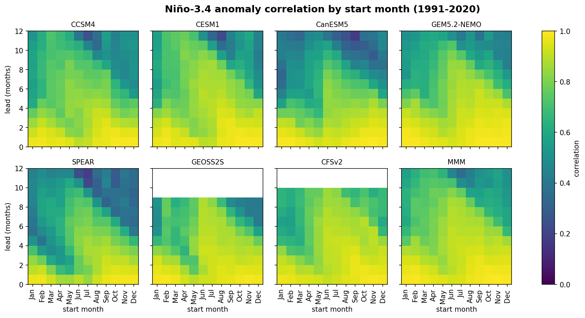
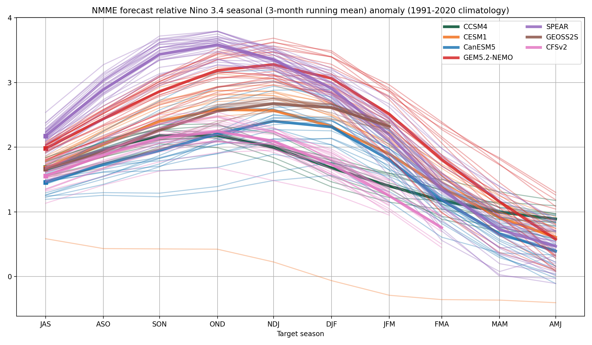

# NMME ENSO

ENSO forecast skill and index diagnostics from the North American Multi-Model
Ensemble (NMME), 1991–present: Niño-3.4 anomaly-correlation and MSESS skill by
model and lead, latest-forecast plumes, and — the part you are least likely to
find written down elsewhere — a worked-out procedure for computing the
**relative Niño-3.4 index** in forecast models. Verification reference is
ERSSTv5.

## Computing relative Niño-3.4 in models

The relative Niño-3.4 index ([L'Heureux, Tippett, et al.
2024](https://doi.org/10.1175/JCLI-D-23-0406.1)) subtracts the tropical-mean
(20°S–20°N) SST anomaly from the Niño-3.4 anomaly — removing the common
warming signal — and rescales so familiar amplitude thresholds keep their
meaning. The paper defines the scaling factor in observations; applying the
index to model forecasts requires extending it. The recipe used here:

1. Compute Niño-3.4 and tropical-mean anomalies against the **model's own**
   hindcast climatology (per model and start month, 1991–2020); difference
   them.
2. Scale by `f(model, start month, lead) = σ_obs(Niño-3.4) / σ_model(relative
   index)` over 1991–2020 starts — matching each model's relative-index
   variance to the observed Niño-3.4 variance, which also corrects model
   ENSO-amplitude biases (computed factors range ~0.5–2.3).
3. Estimate `σ_model` by pooling ensemble members and starts together
   (grand-mean pooling). **Do not** use the standard deviation of the
   ensemble mean: that shrinks with member disagreement, silently mixing
   forecast skill into a variance correction (worth −0.07 MSESS on average
   in our comparison).

The full derivation, the member-pooling evidence, and a worked example are in
**[docs/relative_nino34.md](docs/relative_nino34.md)**.

## Example output

Niño-3.4 anomaly-correlation skill, seven NMME models plus the multi-model
mean, by start month and lead (`scripts/skill.py`):



Latest-forecast plume of the scaled relative Niño-3.4 index — members thin,
ensemble mean thick (`scripts/latest_forecast.py`; regenerated as new
initializations arrive):



> **Known data issue:** IRI is currently serving two corrupt COLA-RSMAS-CESM1
> ensemble members (2026-03 start, member 5; 2026-07 start, member 1),
> reported upstream 2026-07-07. The plume above may show a visible outlier
> member until IRI corrects the source data and the figure is regenerated.

## Quickstart

```bash
# 1. NMME SST zarr store — built by https://github.com/mktippett/nmme-zarr
export NMME_STORE_DIR=/path/to/nmme-zarr/data

# 2. ERSSTv5 monthly means from NOAA PSL — the same command bootstraps and
#    refreshes (-z: only re-download if PSL has a newer file; -R: keep its
#    timestamp). ERSSTv5 updates monthly; re-run before analyzing new forecasts.
dest=observations/ERSSTv5.sst.mnmean.nc
url=https://downloads.psl.noaa.gov/Datasets/noaa.ersst.v5/sst.mnmean.nc
if [ -f "$dest" ]; then
    curl -L -R -z "$dest" -o "$dest" --fail "$url"
else
    curl -L -R -o "$dest" --fail "$url"
fi
export ERSSTV5_NC=$PWD/$dest

# 3. Run any script
mamba run -n pangeo-local python scripts/skill.py
```

## Scripts

| Script | Description | Notable args |
|--------|-------------|--------------|
| `latest_forecast.py` | Niño-3.4 (`n34_*`) and relative Niño-3.4 (`n34r_*`) plume figures (grid, compare, spread, mean; monthly + seasonal variants) from the local NMME zarr store, written to `plots/latest_forecast/` | `--init-date YYYY-MM[-DD]` — plot a specific past initialization (matched by calendar month) instead of the latest; output filenames get a `_<YYYY-MM>` suffix. See `specs/latest_forecast.md`. |
| `skill.py` | Niño-3.4 forecast-skill heatmaps (anomaly correlation, MSESS) vs. ERSSTv5, by model + multi-model mean, start-month and target-month framings, 1991-2020, written to `plots/skill/` | none. See `specs/skill.md`. |
| `rel_scaling_compare.py` | Exploratory/diagnostic (no production figures): evidence for the relative Niño-3.4 scaling factor's member-pooling choice — all 3 pairwise comparisons among per-member, ensemble-mean (flawed), and grand-mean (chosen since 2026-07-07) variance — via MSESS/AC, 1991-2020, written to `plots/rel_scaling_compare/` | none. See `specs/rel_scaling_compare.md`. |

## Data Sources

| Dataset | Location | Notes |
|---------|----------|-------|
| NMME SST hindcasts/forecasts | zarr store built by [mktippett/nmme-zarr](https://github.com/mktippett/nmme-zarr) | 7 models, monthly starts 1991–present; point `NMME_STORE_DIR` at its `data/` directory |
| ERSSTv5 monthly SST | [NOAA PSL](https://psl.noaa.gov/data/gridded/data.noaa.ersst.v5.html) ([direct file](https://downloads.psl.noaa.gov/Datasets/noaa.ersst.v5/sst.mnmean.nc)) | Niño-3.4 verification reference; updated monthly at PSL — the Quickstart `curl -z` re-fetches only when a newer file exists. Point `ERSSTV5_NC` at the local copy. |

## Directory Structure

```
project/
├── scripts/          # analysis scripts
│   └── config.py     # shared constants + data loaders (edit here, not in individual scripts)
├── specs/            # behavioral specifications (one per script) — see below
├── docs/             # methodology notes (relative Niño-3.4 in models)
├── plots/            # canonical output figures (one subdirectory per script)
├── tex/              # Beamer slides
├── papers/           # manuscript references (not committed)
├── notebooks/        # exploratory Jupyter notebooks
└── observations/     # observational/reference datasets (gitignored)
```

Each script has a behavioral specification in `specs/` documenting its
constants, algorithm, edge cases, and scientific rationale, plus a
synchronization log of every change — if you want to understand *why* a
formula is what it is (e.g., the split-climatology treatment of three models'
1999 hindcast discontinuity, or the member-pooling choice), start there.

## Dependencies

- Python: `mamba run -n pangeo-local python`
- Key packages: xarray, zarr (v3), numpy, scipy, matplotlib, pandas, cftime

## Citation

If this repository's methodology is useful in your work, please cite the
paper that defines the relative Niño-3.4 index:

> L'Heureux, M. L., M. K. Tippett, M. C. Wheeler, H. Nguyen, S. Narsey,
> N. Johnson, Z.-Z. Hu, A. B. Watkins, C. Lucas, C. Ganter, E. Becker,
> W. Wang, and T. Di Liberto, 2024: A Relative Sea Surface Temperature Index
> for Classifying ENSO Events in a Changing Climate. *J. Climate*, **37**,
> 1197–1211, https://doi.org/10.1175/JCLI-D-23-0406.1
