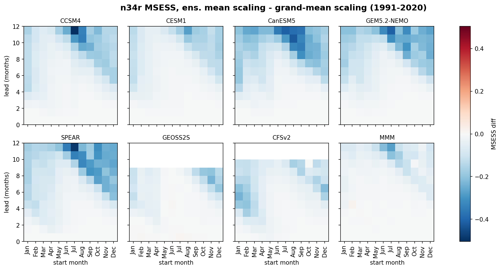

# Computing the Relative Niño-3.4 Index in Forecast Models

This note documents how this project computes the **relative Niño-3.4 index**
for NMME forecast models — including the variance-scaling step, where the
published observational recipe does not directly carry over to models and a
choice must be made. The choice made here, and the evidence behind it, are
written down because we could not find them written down anywhere else.

## 1. Why a relative index

ENSO is conventionally monitored with the Niño-3.4 index: the SST anomaly
averaged over 5°S–5°N, 170°W–120°W. In a warming climate this becomes
ambiguous — the anomaly mixes ENSO variability with the background warming
trend, and event classification drifts as the climatology period is updated.

[Van Oldenborgh et al. (2021)](https://doi.org/10.1029/2021GL095041) proposed
subtracting the tropical-mean SST anomaly, and
[L'Heureux, Tippett, et al. (2024)](https://doi.org/10.1175/JCLI-D-23-0406.1)
developed the operational form used by NOAA CPC, the **relative Niño-3.4
index** (also called RONI):

$$\text{RONI} = \big[\,\text{Niño-3.4 anom} - \langle\text{tropical SST anom}\rangle_{20S-20N}\,\big] \times \frac{\sigma(\text{Niño-3.4 anom})}{\sigma(\text{Niño-3.4 anom} - \langle\text{tropical anom}\rangle)}$$

The subtraction removes the common warming signal; the scaling factor restores
the familiar amplitude of the standard index, so that thresholds like ±0.5 °C
keep their usual meaning. In observations both standard deviations are
computed from the observational record per calendar month, giving a single
scalar per month (≈ 1.1–1.2).

## 2. The question this project had to answer

The paper defines the scaling factor **in observations**. To plot and verify
model forecasts of the relative index on the same footing, the factor must be
defined **for a model forecast** — and the observational recipe does not
transfer verbatim, for two reasons:

1. **Models have their own variance biases.** If the model's relative-index
   variance differs from the observed (some NMME models' ENSO is far too
   energetic), scaling by an obs-only ratio leaves that bias in place.
2. **Forecast variance depends on start month and lead.** A model's
   climatology, drift, and ENSO amplitude all vary with initialization month
   and forecast lead, so a single per-calendar-month number is not stratified
   finely enough.

Per direct guidance from the paper's first author, the principle adopted here
is: *scale the model's relative Niño-3.4 variance to match the observed
1991–2020 Niño-3.4 variance.* Concretely
(`config.rel_scaling_factor`):

$$f(\text{model}, \text{start month}, \text{lead}) = \frac{\sigma_{\text{obs}}(\text{Niño-3.4 anom})}{\sigma_{\text{model}}(\text{relative Niño-3.4 anom})}$$

with both standard deviations stratified by start month and lead, over
1991–2020 forecast starts. This extends the paper in two deliberate ways:
the denominator is the **model's own** relative-index spread (making the
factor model-dependent and bias-correcting), and the stratification is by
**(start month, lead)** rather than calendar month alone. Computed factors
for the seven NMME models range from about 0.5 to 2.3 — i.e., some
model/month/lead combinations need their relative index *halved* to match
observed variance, which is exactly the bias an obs-only factor would ignore.

The model's forecast anomalies themselves (numerator of the relative index)
are computed against the model's own hindcast climatology — per model, per
start month, ensemble-mean seasonal cycle over 1991–2020 targets, with a
split-climatology treatment for three models whose hindcasts have a known
configuration discontinuity in 1999 (see `specs/latest_forecast.md`).

## 3. The subtle part: how to pool ensemble members

The denominator $\sigma_{\text{model}}$ must be estimated from an ensemble
hindcast with dimensions (start `S`, member `M`). There are three natural
estimators, and they are not equivalent:

| | Estimator | Formula (xarray) |
|---|---|---|
| **A** | per-member | `sqrt(x.groupby("S.month").var("S").mean("M"))` |
| **B** | ensemble-mean | `x.mean("M").groupby("S.month").std("S")` |
| **C** | grand-mean *(chosen)* | `sqrt(x.groupby("S.month").var(["S", "M"]))` |

**B is flawed by construction.** Averaging members before taking the variance
shrinks the variance wherever the ensemble disagrees — i.e., wherever skill
is low. A scaling factor built on B therefore mixes *predictability* into a
quantity that is meant to capture only *variance*, contaminating the very
comparison the scaling is supposed to normalize. The damage grows with lead,
as members decorrelate.

**A and C are both valid member-pooling estimators**, equal in expectation
but different in finite samples: C is the pooled standard deviation over the
flattened (start × member) sample and so additionally carries the
between-member spread of the per-member time means (law of total variance),
which A averages out.

### Evidence

`scripts/rel_scaling_compare.py` verifies all three pairwise comparisons
against a common observational target (the paper's own RONI), over 1991–2020:

- **Anomaly correlation is identical across A, B, C** (max difference
  ~10⁻¹⁵). This is expected — correlation is invariant to a positive scalar
  factor within each (model, start-month, lead) stratum — and serves as a
  sanity check that the three runs differ only in the scaling.
- **MSESS separates them.** Mean squared error skill *is* amplitude-sensitive:
  - MSESS(C) − MSESS(B) = **+0.067** averaged over model × month × lead —
    the grand-mean estimator beats the flawed ensemble-mean estimator
    decisively, and the gap grows with lead, consistent with the
    skill-contamination mechanism.
  - MSESS(C) − MSESS(A) = **+0.015** — the two valid estimators are nearly
    equivalent in practice, with grand-mean marginally ahead.



*MSESS(B) − MSESS(C) by start month and lead: predominantly negative,
increasingly so at long lead — the ensemble-mean denominator degrades the
scaled forecast exactly where members have decorrelated.*

**C (grand-mean pooling) is the production choice** — not worse than A on
the evidence, and the simpler estimator to state ("pool all members and
starts together") and to implement.

### Why it matters in practice

A concrete illustration from the July 2026 initialization, during a strong
developing El Niño: peak ensemble-mean forecast anomalies across the seven
NMME models span **+2.6 to +4.9 °C** in the standard Niño-3.4 index — the
upper end driven by models with known excessive ENSO variance — but
**+2.3 to +3.7 °C** in the scaled relative index, with the across-model
spread of the peak reduced from 0.71 to 0.50 °C. The variance matching does
real work: it makes the models' amplitudes comparable to each other and to
observations before any forecast interpretation happens.

## 4. Recipe summary

Given an NMME-style hindcast/forecast dataset with dims
(model, start `S`, member `M`, lead `L`):

1. **Box averages**: cosine-latitude-weighted Niño-3.4 (5°S–5°N, 170°W–120°W)
   and tropical-mean (20°S–20°N, all longitudes) SST.
2. **Model anomalies**: subtract the model's own ensemble-mean seasonal
   cycle, per model and start month, over 1991–2020 (respecting any known
   hindcast discontinuities). Apply the identical procedure to both box
   averages.
3. **Unscaled relative index**: `n34r_raw = n34_anom − trop_anom`.
4. **Scaling factor**, per (model, start month, lead), over 1991–2020 starts:

   ```python
   num = obs_n34_anom.groupby("S.month").std("S")             # obs, target-aligned
   den = np.sqrt(n34r_raw.groupby("S.month").var(["S", "M"])) # grand-mean pooling
   factor = num / den
   ```

5. **Scaled relative index**: `n34r = n34r_raw * factor`, selecting the
   factor by the forecast's model, start month, and lead.
6. If forecasts are smoothed (e.g., 3-month running mean over lead for
   seasonal display), compute a **separate factor from the smoothed fields**
   — running-meaning changes both variances.

Implementation: `config.rel_scaling_factor` (factor),
`config.load_nino34_verification` (anomalies and obs alignment),
`scripts/latest_forecast.py` (application), `scripts/rel_scaling_compare.py`
(evidence). Behavioral details and edge cases: `specs/latest_forecast.md`,
`specs/rel_scaling_compare.md`.

## References

- L'Heureux, M. L., M. K. Tippett, et al., 2024: A Relative Sea Surface
  Temperature Index for Classifying ENSO Events in a Changing Climate.
  *J. Climate*, **37**, 1197–1211,
  [doi:10.1175/JCLI-D-23-0406.1](https://doi.org/10.1175/JCLI-D-23-0406.1).
- van Oldenborgh, G. J., et al., 2021: Defining El Niño indices in a warming
  climate. *Environ. Res. Lett.*, **16**, 044003,
  [doi:10.1088/1748-9326/abe9ed](https://doi.org/10.1088/1748-9326/abe9ed).
